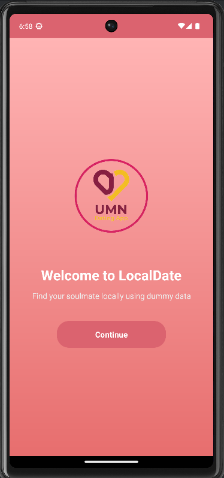

# 💕 UMNDatingApp

<div align="center">
  
  
  **A Modern Dating Application for UMN Students**
  
  [](https://developer.android.com/)
  [](https://kotlinlang.org/)
  [](https://android-arsenal.com/api?level=24)
  [](LICENSE)
</div>

---

## 📱 About The Project

UMNDatingApp is a modern, intuitive dating application specifically designed for Universitas Multimedia Nusantara (UMN) students. The app provides a seamless platform for students to connect, match, and build meaningful relationships within the university community.

### ✨ Key Features

- 🎯 **Smart Matching System** - Swipe-based matching with like/pass functionality
- 💬 **Real-time Messaging** - Firebase-powered instant chat with matched users
- 👤 **Profile Management** - Comprehensive profile with photo verification badge
- 🔍 **Search & Filter** - Real-time search in match list by partner name
- ⭐ **Favorites System** - Add/remove favorites with persistent storage and filtering
- 🔐 **Secure Authentication** - Firebase Auth with email verification and password reset
- 📧 **Email Verification** - Required @student.umn.ac.id domain verification
- 🔑 **Forgot Password** - Secure password reset with email and name verification
- 🚫 **Block/Unblock System** - Block unwanted users with dynamic UI updates
- ❤️ **Likes Management** - View who liked you and manage your likes
- 👎 **Passed Users Management** - View and manage users you've passed on
- 📚 **Interactive Tutorial** - First-time user onboarding guide
- 🎛️ **Settings & Preferences** - Dark mode toggle and app customization
- 📖 **Help & Guide System** - Built-in help and user guide
- 📋 **Terms & Conditions** - Legal compliance and user agreements
- 🎨 **Modern UI/UX** - Material Design 3 with smooth animations
- 🎓 **University Integration** - Major and year-based matching preferences

---

## 🏗️ Architecture & Tech Stack

### **Frontend**
- **Language:** Kotlin
- **UI Framework:** Android Native with ViewBinding
- **Architecture:** MVVM Pattern
- **Navigation:** Fragment-based navigation with BottomNavigationView

### **Backend**
- **Authentication:** Firebase Authentication
- **Database:** Cloud Firestore
- **Real-time Sync:** Firestore Snapshots

### **Key Libraries & Dependencies**
```kotlin
// Core Android Libraries
androidx.core:core-ktx
androidx.appcompat:appcompat
com.google.android.material:material

// Firebase
firebase-bom:33.2.0
firebase-auth-ktx
firebase-firestore-ktx
firebase-analytics

// UI Components
androidx.recyclerview:recyclerview
com.yuyakaido.android:cardstackview  // Card swipe functionality
de.hdodenhof:circleimageview         // Circular profile images
com.facebook.shimmer:shimmer         // Loading animations
androidx.swiperefreshlayout          // Pull to refresh

// Image Loading
com.github.bumptech.glide:glide
com.github.bumptech.glide:compiler

// Data Handling
com.google.code.gson:gson            // JSON parsing
kotlinx-coroutines-play-services     // Firebase coroutines support
```

### **Project Structure**
```
app/src/main/java/com/example/datingapp/
├── activities/          # Activity classes
│   ├── LoginActivity.kt
│   ├── MainActivity.kt
│   ├── OnboardingActivity.kt
│   ├── ProfileEditActivity.kt
│   ├── RegisterActivity.kt
│   └── SplashActivity.kt
├── adapters/           # RecyclerView adapters
│   ├── CardStackAdapter.kt
│   ├── ChatAdapter.kt
│   ├── LikesAdapter.kt
│   ├── MatchAdapter.kt
│   └── MyLikesAdapter.kt
├── fragments/          # Fragment classes
│   ├── ChatFragment.kt
│   ├── HomeFragment.kt
│   ├── LikesFragment.kt
│   ├── MatchListFragment.kt
│   ├── MyLikesFragment.kt
│   ├── ProfileFragment.kt
│   └── ProfileViewFragment.kt
├── models/            # Data models
│   ├── Jurusan.kt
│   ├── Match.kt
│   ├── Message.kt
│   ├── Preferences.kt
│   ├── User.kt
│   └── YearPreferences.kt
└── utils/             # Utility classes
    ├── DummyChatManager.kt
    ├── DummyData.kt
    └── SharedPrefManager.kt
```

---

## 🚀 Getting Started

### Prerequisites
- Android Studio Arctic Fox or later
- Android SDK API 24+ (Target SDK 36)
- Kotlin 1.8+
- Gradle 8.13+
- Firebase Project with Authentication & Firestore enabled

### Installation

1. **Clone the repository**
   ```bash
   git clone https://github.com/yourusername/datingapp-umn.git
   cd datingapp-umn
   ```

2. **Open in Android Studio**
   - Launch Android Studio
   - Select "Open an existing project"
   - Navigate to the cloned directory

3. **Sync Project**
   - Wait for Gradle sync to complete
   - Resolve any dependency issues if prompted

4. **Setup Firebase**
   - Create a Firebase project at [Firebase Console](https://console.firebase.google.com/)
   - Add Android app with package name: `com.example.datingapp`
   - Download `google-services.json` and place in `app/` folder
   - Enable Email/Password authentication
   - Create Firestore database in test mode

5. **Run the Application**
   - Connect an Android device or start an emulator
   - Click the "Run" button or press `Shift + F10`

---

## 📸 Screenshots

<div align="center">
  
  
  
  
</div>

---

## 🎯 Features Overview

### 🏠 Home Screen
- **Card Stack Interface:** Swipe through potential matches with smooth animations
- **Like/Pass Actions:** Swipe right to like, left to pass
- **Smart Filtering:** Matches based on gender, year, and major preferences
- **Block Prevention:** Blocked users won't appear in your feed
- **Real-time Sync:** Instant updates from Firestore

### 💬 Chat System
- **Real-time Messaging:** Firebase-powered instant chat
- **Message Management:** Long-press to delete your messages
- **Block Detection:** Automatic chat prevention for blocked users
- **Profile Access:** Tap partner name/photo to view full profile
- **Message History:** Persistent conversation storage in Firestore

### 👤 Profile Management
- **Profile Editing:** Update bio, age, school year, major, and preferences
- **Password Management:** Change password with old password verification
- **Verified Badge:** Blue checkmark for verified profile photos
- **Account Deletion:** Complete account removal with data cleanup
- **Preference Settings:** Gender, year range, and major preferences

### ⭐ Favorites System
- **Add to Favorites:** Long-press matches to add/remove from favorites
- **Favorites Filter:** Toggle star icon to view only favorite matches
- **Persistent Storage:** Favorites saved to Firestore and persist across sessions
- **Real-time Updates:** Instant sync across all devices
- **Performance Optimized:** Fast lookup with efficient data structures

### ❤️ Likes System
- **See Who Liked You:** View users who swiped right on your profile
- **My Likes:** Track users you've liked
- **Match Creation:** Automatic match when both users like each other
- **Real-time Updates:** Instant notification of new likes

### 👎 Passed Users Management
- **View Passed Users:** See all users you've swiped left on
- **Unpass Feature:** Remove users from passed list to see them again
- **Grid Layout:** Easy browsing of passed users with photos
- **Profile Access:** Tap to view full profile of passed users
- **Batch Loading:** Efficient loading of large passed user lists

### 🔍 Match List
- **Real-time Search:** Filter matches by partner name as you type
- **Match Management:** View all your matches in one place
- **Tab Organization:** Active, Inactive, and Blocked match categories
- **Favorites Integration:** Filter to show only favorite matches
- **Last Message Preview:** See the most recent message
- **Direct Chat Access:** Tap to open conversation

### 🚫 Block/Unblock System
- **Dynamic UI:** Block/Unblock text changes based on current status
- **User Blocking:** Block unwanted users from your profile view
- **Chat Prevention:** Blocked users cannot message you
- **Feed Filtering:** Blocked users won't appear in swipe cards
- **Easy Management:** Long-press matches for block/unblock options
- **Mutual Protection:** Works both ways for safety

### 🔐 Authentication & Security
- **Email Verification:** Required verification for @student.umn.ac.id emails only
- **Domain Restriction:** Only UMN student emails allowed for registration
- **Forgot Password:** Secure reset requiring both email and full name verification
- **Firebase Auth:** Secure email/password authentication
- **Session Management:** Persistent login with auto-redirect
- **Password Security:** Re-authentication required for password changes

### 📚 Tutorial System
- **First-Time Onboarding:** Interactive tutorial for new users
- **Step-by-Step Guide:** Covers all main app features
- **Skip Option:** Users can skip tutorial at any time
- **One-Time Display:** Tutorial only shows once per user
- **Feature Highlights:** Guides through swiping, matching, profile, and help

### 🎛️ Settings & Preferences
- **Dark Mode Toggle:** Switch between light and dark themes
- **Persistent Settings:** Settings saved across app sessions
- **Terms Access:** Quick access to Terms & Conditions
- **Theme Switching:** Real-time theme changes without restart

### 📖 Help & Guide System
- **Built-in Guide:** Comprehensive help documentation
- **Easy Access:** Guide button available from main navigation
- **User Support:** Step-by-step instructions for app features

### 📋 Terms & Conditions
- **Legal Compliance:** Complete terms and conditions
- **Registration Requirement:** Must agree to terms during signup
- **Easy Access:** Available from settings and registration
- **Dedicated Activity:** Full-screen terms viewing

---

## 👥 Development Team

<table align="center">
  <tr>
    <td align="center">
      <br />
      <sub><b>Felicia Sabatini Gunawan</b></sub><br />
      <sub>00000093843</sub><br />
    </td>
    <td align="center">
      <br />
      <sub><b>Frendhy Zhuang</b></sub><br />
      <sub>00000092876</sub><br />
    </td>
    <td align="center">
      <br />
      <sub><b>Rafael Natanael</b></sub><br />
      <sub>00000093739</sub><br />
    </td>
    <td align="center">
      <br />
      <sub><b>Sharon Tionardi</b></sub><br />
      <sub>00000095084</sub><br />
    </td>
  </tr>
</table>

---

## 🛠️ Development Guidelines

### Code Style
- Follow [Kotlin Coding Conventions](https://kotlinlang.org/docs/coding-conventions.html)
- Use meaningful variable and function names
- Add comments for complex logic
- Maintain consistent indentation (4 spaces)

### Git Workflow
```bash
# Create feature branch
git checkout -b feature/your-feature-name

# Make changes and commit
git add .
git commit -m "feat: add your feature description"

# Push and create pull request
git push origin feature/your-feature-name
```

### Testing
- Write unit tests for utility functions
- Test UI components with Espresso
- Perform manual testing on different devices

---

## 📋 Project Status

### ✅ Completed Features
- [x] Firebase Authentication (Login/Register)
- [x] Email Verification with @student.umn.ac.id Domain Restriction
- [x] Forgot Password with Email & Name Verification
- [x] Cloud Firestore Integration
- [x] Profile Creation and Management
- [x] Profile Photo Verification Badge
- [x] Card Stack Matching Interface
- [x] Real-time Chat System with Firestore
- [x] Match List with Real-time Search and Tabs
- [x] Favorites System with Persistent Storage
- [x] Likes Management (See Likes & My Likes)
- [x] Block/Unblock System with Dynamic UI
- [x] Password Change with Re-authentication
- [x] Account Deletion with Data Cleanup
- [x] Interactive Tutorial for First-Time Users
- [x] Passed Users Management with Unpass Feature
- [x] Settings with Dark Mode Toggle
- [x] Help & Guide System
- [x] Terms & Conditions Integration
- [x] Onboarding Flow
- [x] Splash Screen
- [x] Bottom Navigation
- [x] Pull to Refresh
- [x] Shimmer Loading Effects

---

## 🤝 Contributing

We welcome contributions from the UMN community! Please follow these steps:

1. Fork the repository
2. Create your feature branch (`git checkout -b feature/AmazingFeature`)
3. Commit your changes (`git commit -m 'Add some AmazingFeature'`)
4. Push to the branch (`git push origin feature/AmazingFeature`)
5. Open a Pull Request

---

## 📄 License

This project is licensed under the MIT License - see the [LICENSE](LICENSE) file for details.

---

<div align="center">
  <p><strong>Made with ❤️ by UMN Students for UMN Students</strong></p>
  <p><em>Connecting Hearts, Building Futures</em></p>
</div>

---

## 🔥 Firebase Integration

### Firestore Collections
```
users/
  {userId}/
    - uid, username, name, email, bio, age
    - schoolyear, gender, major, photoUrl
    - photoVerified (boolean)
    - preference { gender, yearPreferences, majorPreferences }

matches/
  {matchId}/
    - users: [userId1, userId2]
    - timestamp, lastMessage
    chats/
      {chatId}/
        - senderId, text, timestamp

swipes/
  {userId}/
    - liked: [userIds]
    - passed: [userIds]

blocks/
  {userId}/
    - blockedUsers: [userIds]

favorites/
  {userId}/
    - favoriteUsers: [userIds]

# Note: Passed users are stored in swipes collection under 'passed' field
```

### Security Rules
See `FIREBASE_SETUP.md` for detailed Firestore security rules configuration.

---

## 🙏 Acknowledgments

- **Universitas Multimedia Nusantara** for providing the educational environment
- **Firebase** for backend infrastructure
- **Android Development Community** for excellent documentation and resources
- **Open Source Libraries** that made this project possible
- **Beta Testers** from UMN student community

---

<div align="center">
  <sub>© 2025 DatingAppUMN Team. All rights reserved.</sub>
</div>
