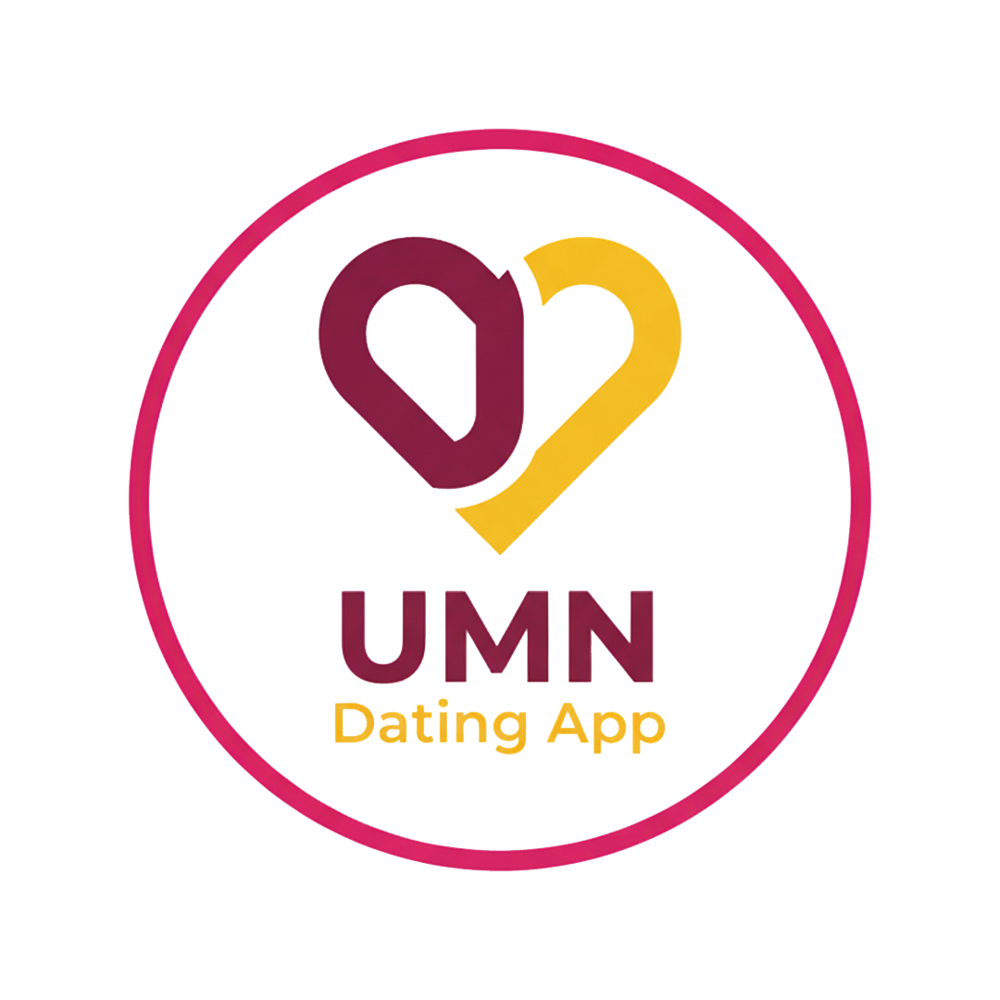

# 💕 DatingAppUMN

<div align="center">
  
  
  **A Modern Dating Application for UMN Students**
  
  [](https://developer.android.com/)
  [](https://kotlinlang.org/)
  [](https://android-arsenal.com/api?level=24)
  [](LICENSE)
</div>

---

## 📱 About The Project

DatingAppUMN is a modern, intuitive dating application specifically designed for Universitas Multimedia Nusantara (UMN) students. The app provides a seamless platform for students to connect, match, and build meaningful relationships within the university community.

### ✨ Key Features

- 🎯 **Smart Matching System** - Advanced algorithm to find compatible matches
- 💬 **Real-time Messaging** - Instant chat functionality with match partners
- 👤 **Profile Management** - Comprehensive profile creation and editing
- 🎨 **Modern UI/UX** - Clean, intuitive interface with smooth animations
- 🔐 **Secure Authentication** - Safe login and registration system
- 📊 **Match Analytics** - Track your connections and interactions
- 🎓 **University Integration** - Tailored specifically for UMN students

---

## 🏗️ Architecture & Tech Stack

### **Frontend**
- **Language:** Kotlin
- **UI Framework:** Android Native with ViewBinding
- **Architecture:** MVVM Pattern
- **Navigation:** Fragment-based navigation with BottomNavigationView

### **Key Libraries & Dependencies**
```kotlin
// Core Android Libraries
androidx.core:core-ktx
androidx.appcompat:appcompat
com.google.android.material:material

// UI Components
androidx.recyclerview:recyclerview
com.yuyakaido.android:cardstackview  // Card swipe functionality
de.hdodenhof:circleimageview         // Circular profile images

// Image Loading
com.github.bumptech.glide:glide
com.github.bumptech.glide:compiler

// Data Handling
com.google.code.gson:gson            // JSON parsing
```

### **Project Structure**
```
app/src/main/java/com/example/datingapp/
├── activities/          # Activity classes
│   ├── LoginActivity.kt
│   ├── MainActivity.kt
│   ├── OnboardingActivity.kt
│   ├── ProfileEditActivity.kt
│   └── RegisterActivity.kt
├── adapters/           # RecyclerView adapters
│   ├── CardStackAdapter.kt
│   ├── ChatAdapter.kt
│   └── MatchAdapter.kt
├── fragments/          # Fragment classes
│   ├── ChatFragment.kt
│   ├── HomeFragment.kt
│   ├── MatchListFragment.kt
│   ├── ProfileFragment.kt
│   └── ProfileViewFragment.kt
├── models/            # Data models
│   ├── Jurusan.kt
│   ├── Match.kt
│   ├── Message.kt
│   ├── Preferences.kt
│   ├── User.kt
│   └── YearPreferences.kt
└── utils/             # Utility classes
    ├── DummyChatManager.kt
    ├── DummyData.kt
    └── SharedPrefManager.kt
```

---

## 🚀 Getting Started

### Prerequisites
- Android Studio Arctic Fox or later
- Android SDK API 24+
- Kotlin 1.8+
- Gradle 8.0+

### Installation

1. **Clone the repository**
   ```bash
   git clone https://github.com/yourusername/datingapp-umn.git
   cd datingapp-umn
   ```

2. **Open in Android Studio**
   - Launch Android Studio
   - Select "Open an existing project"
   - Navigate to the cloned directory

3. **Sync Project**
   - Wait for Gradle sync to complete
   - Resolve any dependency issues if prompted

4. **Run the Application**
   - Connect an Android device or start an emulator
   - Click the "Run" button or press `Shift + F10`

---

## 📸 Screenshots

<div align="center">
  
  
  
  
</div>

---

## 🎯 Features Overview

### 🏠 Home Screen
- **Card Stack Interface:** Swipe through potential matches with smooth animations
- **Like/Dislike Actions:** Intuitive gesture-based matching system
- **Real-time Updates:** Dynamic content loading and updates

### 💬 Chat System
- **Instant Messaging:** Real-time chat with matched users
- **Message History:** Persistent conversation storage
- **User-friendly Interface:** Clean chat bubbles with timestamp support

### 👤 Profile Management
- **Comprehensive Profiles:** Detailed user information including major, year, and preferences
- **Photo Management:** Multiple profile picture support
- **Preference Settings:** Customizable matching criteria

### 🔐 Authentication
- **Secure Registration:** Email-based account creation
- **Login System:** Persistent session management
- **Data Protection:** Secure user data handling

---

## 👥 Development Team

<table align="center">
  <tr>
    <td align="center">
      <br />
      <sub><b>Felicia Sabatini Gunawan</b></sub><br />
      <sub>00000093843</sub><br />
      <sub>🎨 UI/UX Designer & Frontend Developer</sub>
    </td>
    <td align="center">
      <br />
      <sub><b>Frendhy Zhuang</b></sub><br />
      <sub>00000092876</sub><br />
      <sub>📱 Android Developer & Architecture</sub>
    </td>
    <td align="center">
      <br />
      <sub><b>Rafael Natanael</b></sub><br />
      <sub>00000093739</sub><br />
      <sub>⚙️ Backend Integration & Logic</sub>
    </td>
    <td align="center">
      <br />
      <sub><b>Sharon Tionardi</b></sub><br />
      <sub>00000095084</sub><br />
      <sub>🔧 Testing & Quality Assurance</sub>
    </td>
  </tr>
</table>

---

## 🛠️ Development Guidelines

### Code Style
- Follow [Kotlin Coding Conventions](https://kotlinlang.org/docs/coding-conventions.html)
- Use meaningful variable and function names
- Add comments for complex logic
- Maintain consistent indentation (4 spaces)

### Git Workflow
```bash
# Create feature branch
git checkout -b feature/your-feature-name

# Make changes and commit
git add .
git commit -m "feat: add your feature description"

# Push and create pull request
git push origin feature/your-feature-name
```

### Testing
- Write unit tests for utility functions
- Test UI components with Espresso
- Perform manual testing on different devices

---

## 📋 Project Status

### ✅ Completed Features
- [x] User Authentication (Login/Register)
- [x] Profile Creation and Management
- [x] Card Stack Matching Interface
- [x] Real-time Chat System
- [x] Match List and Management
- [x] Onboarding Flow
- [x] Bottom Navigation

### 🚧 In Progress
- [ ] Push Notifications
- [ ] Advanced Matching Algorithm
- [ ] Photo Upload from Camera
- [ ] Location-based Matching

### 📅 Future Enhancements
- [ ] Video Chat Integration
- [ ] Social Media Integration
- [ ] Advanced Profile Verification
- [ ] Dating Event Organization
- [ ] Premium Features

---

## 🤝 Contributing

We welcome contributions from the UMN community! Please follow these steps:

1. Fork the repository
2. Create your feature branch (`git checkout -b feature/AmazingFeature`)
3. Commit your changes (`git commit -m 'Add some AmazingFeature'`)
4. Push to the branch (`git push origin feature/AmazingFeature`)
5. Open a Pull Request

---

## 📄 License

This project is licensed under the MIT License - see the [LICENSE](LICENSE) file for details.

---

## 📞 Contact & Support

For questions, suggestions, or support, please reach out to our development team:

- **Project Repository:** [GitHub Repository](https://github.com/yourusername/datingapp-umn)
- **Issues & Bug Reports:** [GitHub Issues](https://github.com/yourusername/datingapp-umn/issues)
- **Email:** datingapp.umn@gmail.com

---

<div align="center">
  <p><strong>Made with ❤️ by UMN Students for UMN Students</strong></p>
  <p><em>Connecting Hearts, Building Futures</em></p>
</div>

---

## 🙏 Acknowledgments

- **Universitas Multimedia Nusantara** for providing the educational environment
- **Android Development Community** for excellent documentation and resources
- **Open Source Libraries** that made this project possible
- **Beta Testers** from UMN student community

---

<div align="center">
  <sub>© 2024 DatingAppUMN Team. All rights reserved.</sub>
</div>